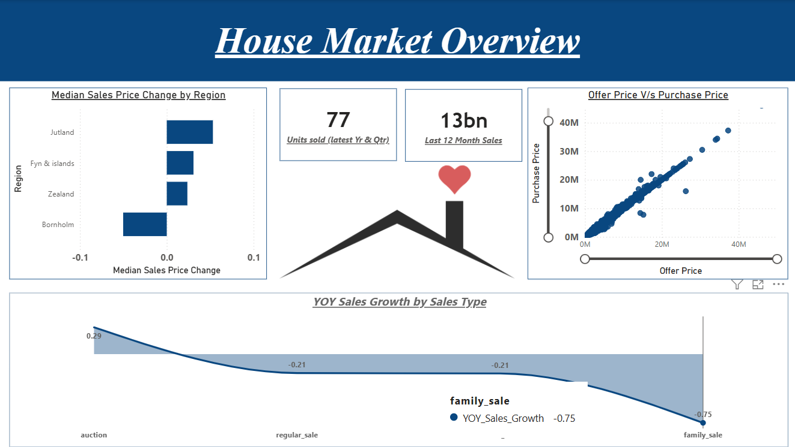
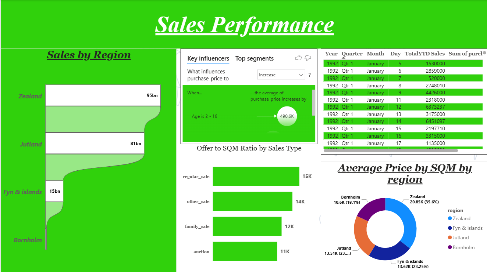
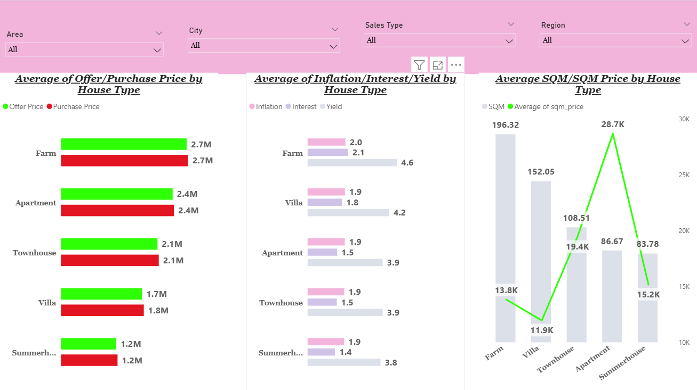

# PowerBI-Housing-Sales-Analytics
Interactive Power BI dashboard analyzing U.S. housing sales data with DAX, Power Query, and data modeling. Delivers insights into pricing trends, regional performance, sales KPIs, and market dynamics through executive-level visualizations.

## Overview
This project presents an end-to-end Power BI dashboard developed to analyze housing market performance using Google BigQuery, Power Query, and DAX. The dashboard provides insights into regional sales trends, pricing patterns, and key factors influencing property values through interactive visualizations.

The objective of this project is to demonstrate a real-world analytics workflow involving data extraction, cleaning, transformation, modeling, and visualization to support data-driven decision-making.
## Dashboard Preview

### House Market Overview

### Sales Performance

### Key Influencers

---

## Business Objective
Housing market stakeholders need visibility into price trends, regional performance, and property characteristics to make informed decisions. This dashboard enables users to:

• Identify high-performing regions  
• Analyze trends in housing prices  
• Track year-over-year growth  
• Understand factors influencing property value  
• Monitor recent sales performance  

---

## Dataset
The dataset contains structured housing transaction data with the following attributes:

- house_id
- date
- purchase_price
- offer_price
- region
- house_type
- sqm (area)
- year_build
- interest_rate
- inflation_rate

Data was connected from Google BigQuery and transformed using Power Query.

---

## Tools & Technologies
• Power BI  
• DAX (Data Analysis Expressions)  
• Power Query  
• Google BigQuery  
• SQL  
• Data Visualization  

---

## Dashboard Features

### 1. House Market Overview
Provides high-level performance metrics and pricing insights:

Key KPIs:
- Total Sales
- Median Sales Price
- Units Sold
- Year-over-Year Sales Growth
- Last 12 Months Sales

Visuals:
- KPI Cards
- Scatter plot (Offer Price vs Purchase Price)
- Median price by region comparison

---

### 2. Sales Performance Analysis
Provides regional and factor-based analysis of housing sales:

Visuals:
- Sales by Region bar chart
- Distribution by house type (donut chart)
- Key Influencers visual identifying drivers of purchase price
- Offer price vs purchase price comparison
- Property age impact on price

---

## Key Metrics Created (DAX)

### Year-over-Year Sales Growth
Measures percentage change in total sales compared to the previous year.

### Total Year-to-Date Sales
Tracks cumulative sales from the beginning of the year to the latest available date.

### Last 12 Months Sales
Calculates rolling 12-month sales performance to identify trends.

### Units Sold in Latest Quarter
Counts distinct properties sold in the most recent quarter.

### Median Sales Price
Calculates the median purchase price across properties.

### Sales by Region
Aggregates total sales for regional comparison.

### Property Age
Calculates property age using sale date and year built.

### Offer Price per Square Meter
Standardizes pricing based on property size.

---

## Key Insights
• Regional differences significantly impact housing sales performance  
• Property size (sqm) influences purchase price trends  
• Offer price strongly correlates with final purchase price  
• Property age contributes to price variation  
• Rolling 12-month trends help identify market direction  

---
## Analytical Rigor

This project demonstrates structured analytical thinking through systematic data preparation, metric design, and interpretation of housing market trends. The analysis extends beyond basic visualization by applying statistical aggregation, time intelligence calculations, and dimensional comparisons to extract meaningful business insights.

### Data Preparation and Validation
Data was cleaned and transformed using Power Query to ensure consistency, accuracy, and usability for analysis. Date fields were standardized to support time-series evaluation, and derived variables such as property age and price per square meter were created to enhance interpretability. Data types were validated to ensure compatibility with DAX time intelligence functions.

### Metric Design using DAX
Key performance indicators were developed using advanced DAX functions including TOTALYTD, DATESINPERIOD, MEDIANX, CALCULATE, and ALLEXCEPT. These measures allow consistent comparison of sales performance across different time periods and regions. Time-based calculations such as rolling 12-month sales and year-over-year growth were used to capture trend dynamics rather than isolated point-in-time values.

### Dimensional Analysis
The dashboard evaluates housing performance across multiple analytical dimensions, including region, property type, property size, and property age. Aggregation logic ensures fair comparison between groups, while median-based metrics reduce the effect of outliers commonly observed in real estate datasets.

### Trend and Relationship Analysis
Scatter plots and Key Influencers visuals were used to explore relationships between offer price, purchase price, square meters, and property age. These techniques support identification of variables that influence housing price variation and help uncover patterns within the data.

### Business-Oriented Interpretation
The analytical approach prioritizes decision-support insights rather than descriptive summaries. Regional comparisons highlight differences in housing demand and pricing behavior, while time intelligence metrics provide visibility into market growth patterns. Derived features such as price per square meter improve comparability across properties of different sizes.

Overall, the project demonstrates the application of structured metric design, dimensional analysis, and time-based modeling to generate actionable insights from housing market data.
